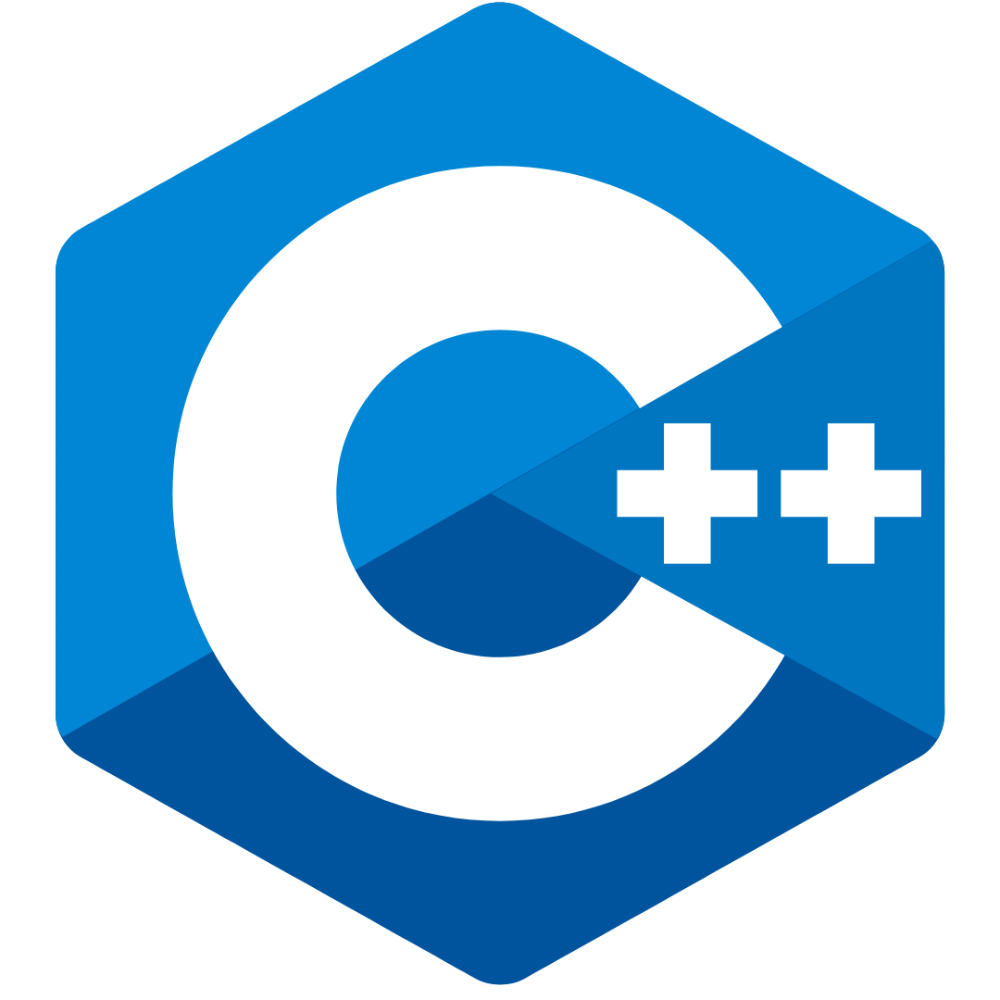
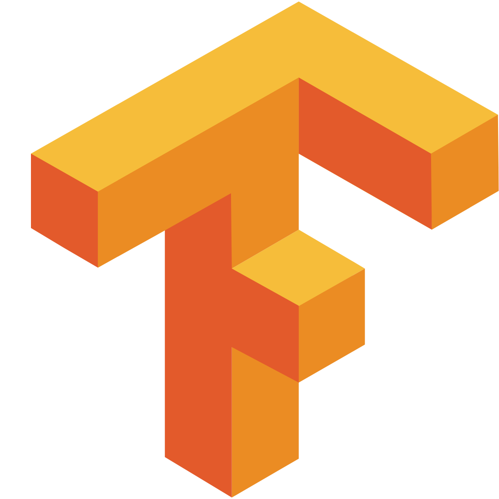
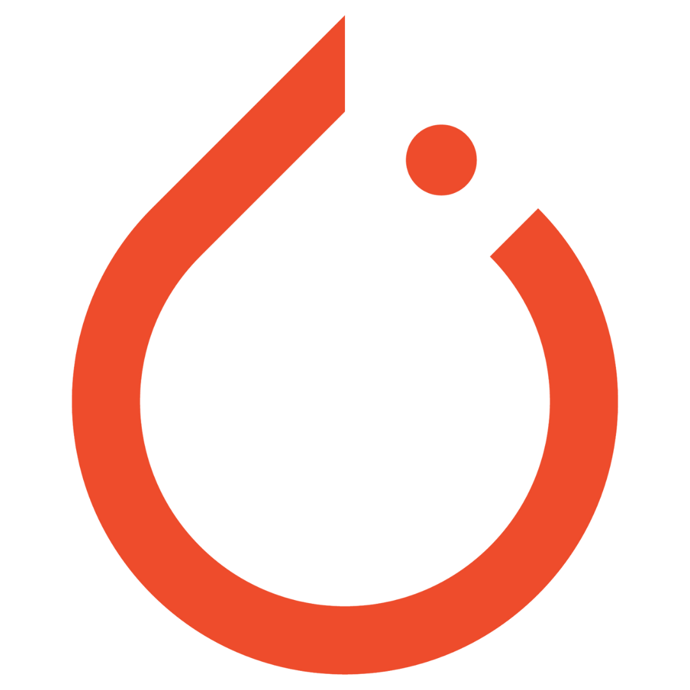
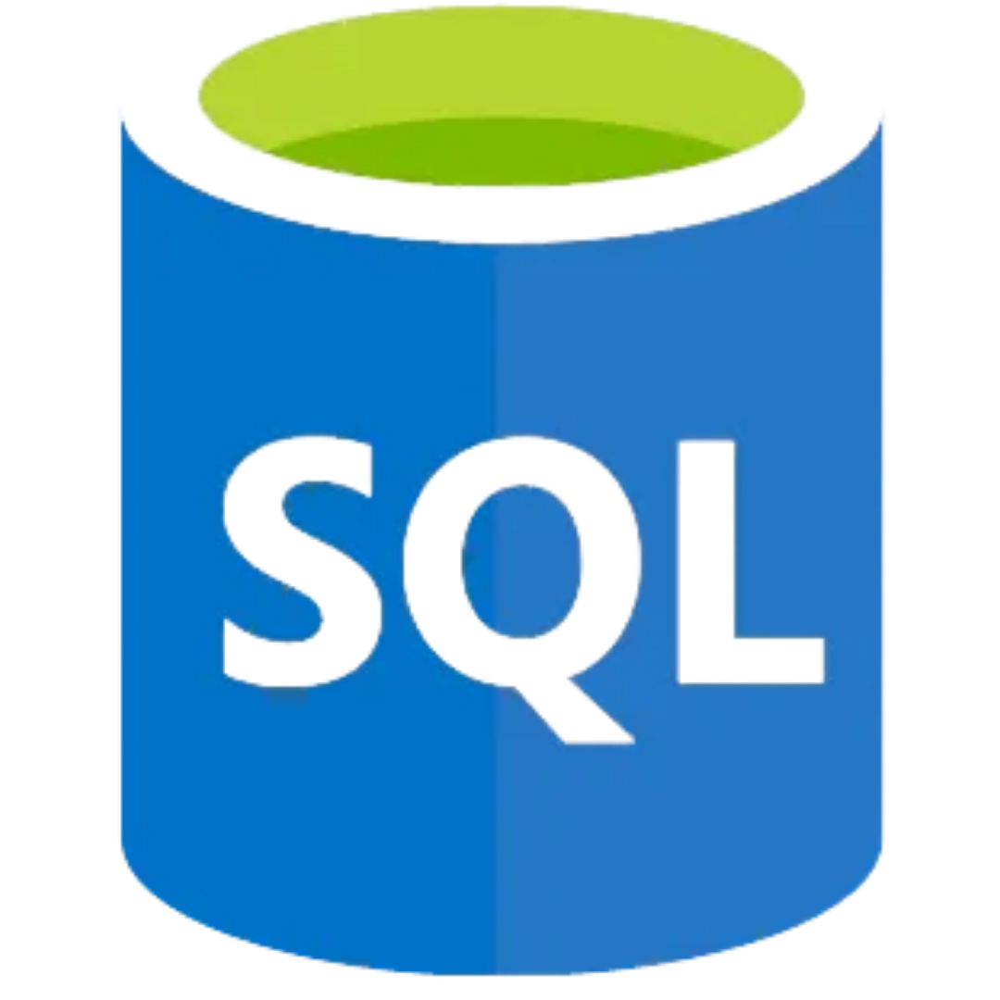
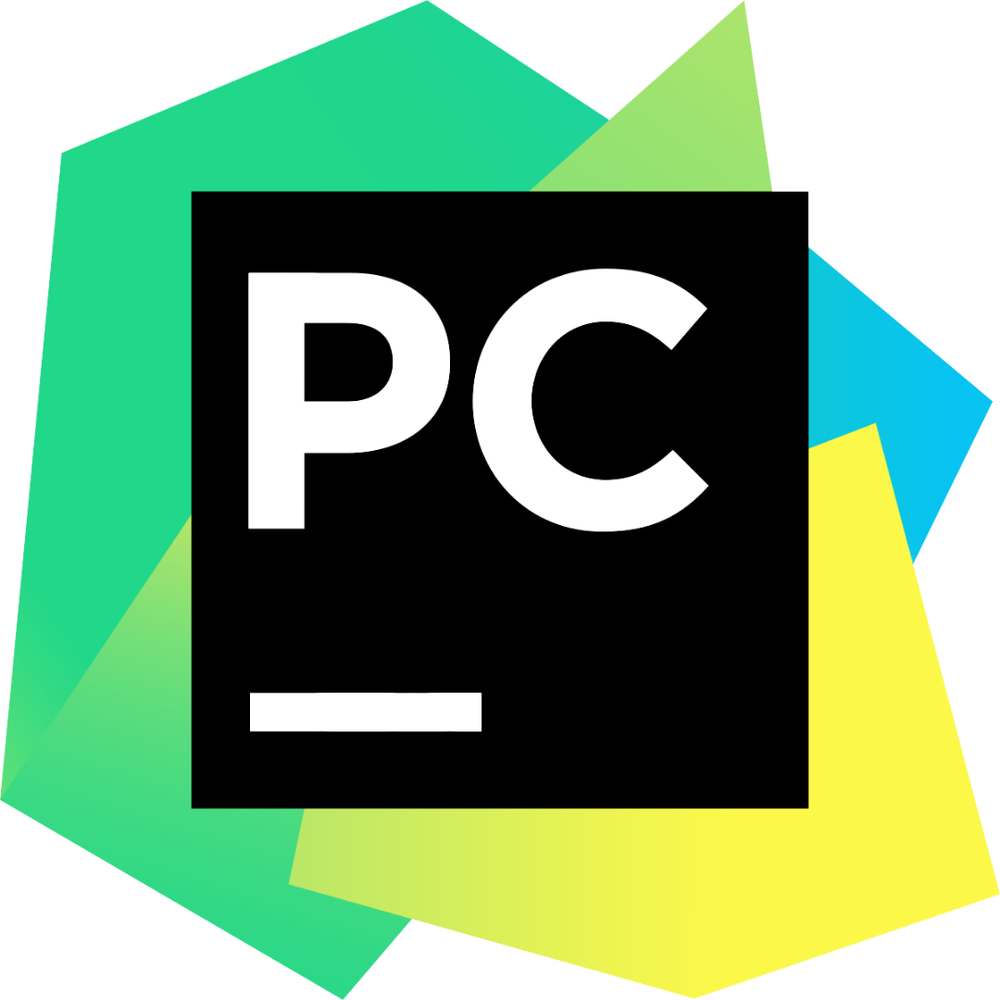

<!-- 
GIF SECTION

If you wanna know how i made this gif

I made this with my repo: (https://github.com/DavidsDvm/GitHub_ProfileReadmeGIF)
There i made and page with the GIF content, later i record my screen with OBS
after that i converter the video from mp4 to gif
ur welcome ;) 
-->

<!-- Social icons section -->
<h1 align="center"> Social Media: </h1>
  

    <a href="https://twitter.com/AryanSo98827382">
      
    
    
  

</h1>

<!-- Description about me -->
<h2 align="center"> 🤔 About me 👨‍💻 </h2>

Eyyyy!!!  
I am <b>Aryan Solanki</b> 
I am from <strong>Delhi, India</strong>  
I'm a guy who loves to develop new things 🖥️  
So... I am more than a robot coding 🤖, I am a real human trying to learn new things and develop incredible projects with ❤️ meeting incredible people on the way🚀 
If you are interested in a guy with a good vibe who loves the knowledge and the constant learning 📚, <b>⚙️I AM YOUR GUY⚙️</b>  
Contact me for new projects 📨, I am open to collaborate with you
   

### 🧐 More About Me:

- 🔭 &nbsp; I’m currently studying at **BENNETT UNIVERSITY**
- 🤝 &nbsp; I’m looking to collaborate on Open Source Proyects
- 🌱 &nbsp; I’m currently learning Flutter; 
- 👨🏻‍💻 &nbsp; Most of my projects are available on [Github](https://github.com/Aryan-Solanki?tab=repositories)
- 💬 &nbsp; Ask me about anything tech related, I am happy to help (if you have questions with linux you can ask me🐧);
- 📫 &nbsp; Feel free to contact me on [LinkedIn](https://www.linkedin.com/in/aryan-solanki-3b13191b5/)
- 🎷 &nbsp; When I am free, I like to watch web series

   

<!-- languajes and skills section -->

<h1 align="center"> Languages/Frameworks I'm good at: </h1>

  <code></code>
<code></code>
  <code></code>
  <code></code>
  <code></code>
  <code></code>
  <code></code>
  

 

<h1 align="center"> Languages/Frameworks I'm learning: </h1>

   <code></code>
  <code></code>
  <code></code>
  

 

<h1 align="center"> Environments I work with: </h1>

  <code></code>
  <code></code>
  <code></code>
  <code></code>

 

<!-- GitHub stats section -->

## 📊 Github stats

<!-- Bassed on: https://github.com/anuraghazra/github-readme-stats -->

   
  
  
   
  <b>Note:</b> Top languages is only a metric of the languages my public code consists of and doesn't reflect experience or skill level.

<!-- Projects section -->

<!-- last activity section -->

## Activity Graph

  

 

<!-- last refresh of readme section -->

## Visitors Count

 

Last refresh: <b>Friday, October 9, 01:35 AM IST

